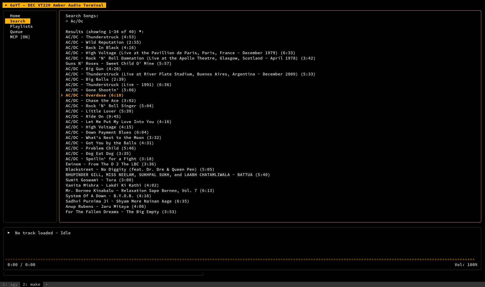
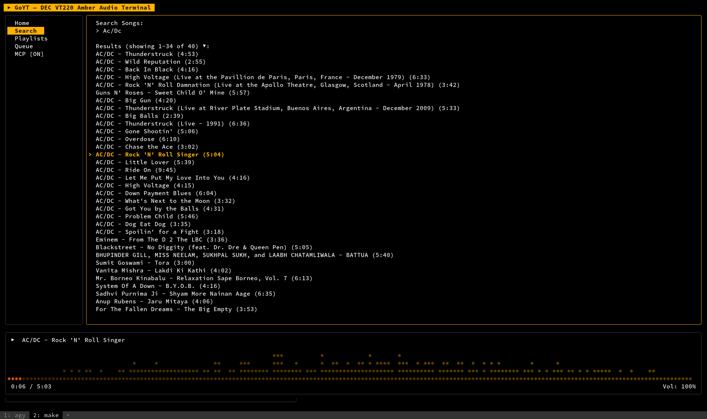

# GoYT — YouTube Music CLI Player in Go

GoYT is a fast, keyboard-driven Terminal User Interface (TUI) music player for YouTube Music, written in Go. It is inspired by `involvex/youtube-music-cli` but compiled natively into a single lightweight binary, removing Node.js/Bun runtime overhead and skipping custom extensions or track downloads.

## Screenshots

### Search View


### Playback with Equalizer


---

## Features

* **Sleek TUI Layout:** Built using Charm's Bubble Tea, Lip Gloss, and Bubbles libraries with a retro DEC VT220 amber theme.
* **Efficient Player Control:** Offloads streaming playback to a background `mpv` daemon and communicates via JSON IPC.
* **Streaming-Only Queue:** Built-in play queues with track skip, volume control, and shuffle.
* **Playlist Management:** Create, browse, and delete playlists directly from the terminal. Add any track to new or existing playlists with the `m` key.
* **MCP Server (Model Context Protocol):** Exposes a Streamable HTTP server so AI assistants (like Google Antigravity) can search, queue tracks, manage playlists, and control playback remotely.
* **Real-Time Equalizer:** Audio-reactive visualizer driven by mpv's `astats` filter metadata.
* **Low Memory Footprint:** Runs in ~15MB of RAM (compared to 100MB+ for Electron or TS wrappers).

---

## Pre-requisites

GoYT offloads video stream resolution and playback to **`mpv`** and **`yt-dlp`**. You must have both installed and present in your system's `PATH`.

### Linux (Ubuntu/Debian)
```bash
sudo apt update
sudo apt install mpv yt-dlp
```

### Linux (Arch)
```bash
sudo pacman -S mpv yt-dlp
```

### macOS (Homebrew)
```bash
brew install mpv yt-dlp
```

---

## Installation & Running

### 1. Build from Source
From the project workspace root, build the executable:
```bash
go build -o goyt ./cmd/goyt/...
```

### 2. Run the App
```bash
./goyt
```

---

## Keyboard Controls

| Key | Action |
| :--- | :--- |
| `Tab` | Toggle focus between Sidebar navigation and active workspace |
| `Up` / `Down` (or `j` / `k`) | Navigate sidebar tabs, search results, playlists, or the play queue |
| `Enter` | Open sidebar tab, focus search bar, open a playlist, or play a track |
| `/` | Focus the search bar (in Search view) |
| `a` | Add the selected track to the queue, or add ALL tracks in a playlist to the queue |
| `m` / `M` | Add the highlighted track to a new or existing playlist |
| `d` / `D` | Delete the highlighted playlist (in Playlists view, with confirmation) |
| `Esc` / `Backspace` | Blur search box, go back from playlist details, or cancel playlist selector |
| `Space` | Toggle Play / Pause (or toggle MCP status in MCP view) |
| `n` | Skip to Next track |
| `p` | Skip to Previous track |
| `[` | Decrease volume (by 5%) |
| `]` | Increase volume (by 5%) |
| `Left` / `Right` | Seek backward / forward 10 seconds |
| `q` or `Ctrl+C` | Quit player |

---

## MCP Server (AI Integration)

GoYT embeds a [Model Context Protocol](https://modelcontextprotocol.io/) server on port `8080`, exposing the following tools to AI assistants:

| Tool | Description |
| :--- | :--- |
| `search` | Search YouTube Music and return results |
| `get_library_playlists` | List all playlists in the user's library |
| `get_playlist_tracks` | Get all tracks from a specific playlist |
| `add_track_to_queue` | Add a track to the play queue |
| `add_playlist_to_queue` | Add all tracks from a playlist to the queue |
| `play_pause` | Play, pause, or toggle playback |
| `get_playback_info` | Get current track, progress, and volume |
| `create_playlist` | Create a new private playlist |
| `add_track_to_playlist` | Add a track to an existing playlist |
| `delete_playlist` | Delete a playlist by ID |

### Connecting from Google Antigravity

Add this to your Antigravity MCP configuration:
```json
{
  "goyt": {
    "serverUrl": "http://localhost:8080/sse"
  }
}
```

The MCP server status and connected clients can be monitored in the **MCP** sidebar tab, where it can also be toggled on/off.

---

## Architecture

GoYT follows **Hexagonal Architecture** (Ports & Adapters) to cleanly separate domain logic from infrastructure concerns:

```
cmd/goyt/main.go          # Entry point: wiring adapters to ports
internal/
  domain/
    model/                 # Domain entities: Track, Playlist, Queue, Theme
    port/                  # Port interfaces: MusicCatalogPort, AudioPlayerPort
  adapter/
    catalog/ytmusic/       # Driven adapter: YouTube Music InnerTube API client
    tui/                   # Driving adapter: Bubble Tea terminal UI
    mcp/                   # Driving adapter: MCP Streamable HTTP server
pkg/
  ytmusic/                 # Low-level InnerTube HTTP client wrapper
  player/                  # Headless mpv manager and JSON IPC driver
```
